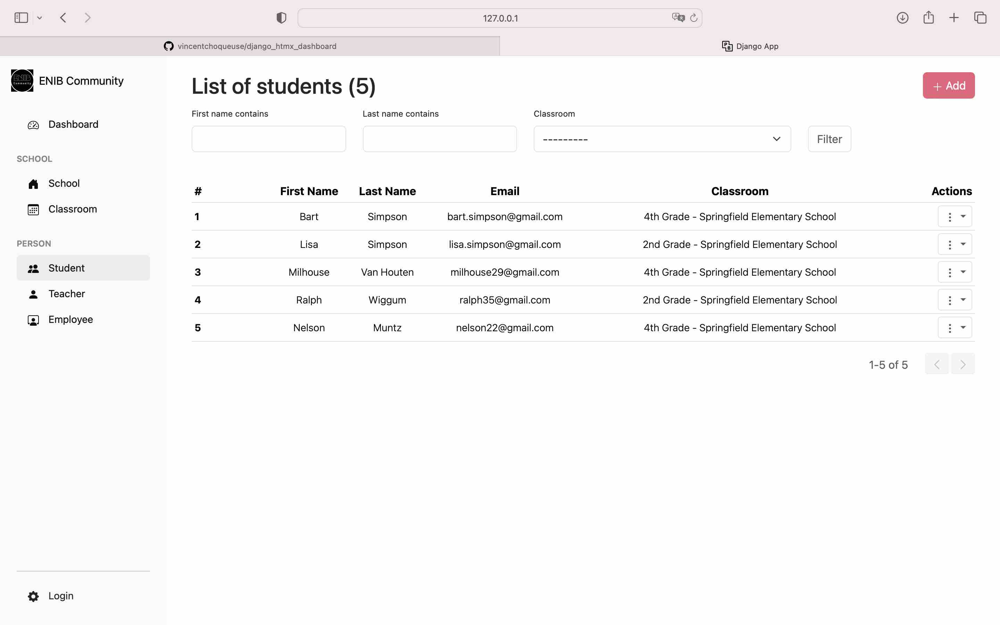
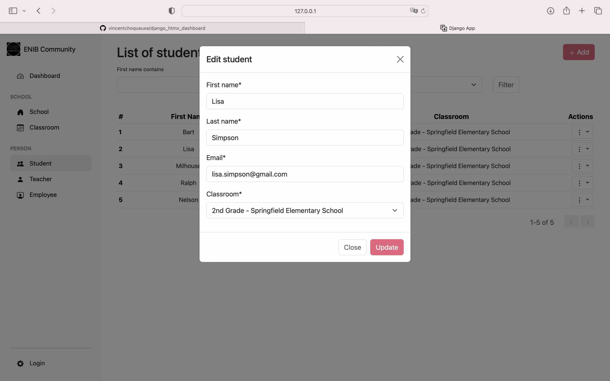

# A Flat Django + HTMX Simple Dashboard App

## Description

This repository contains a simple dashboard application built with Django and HTMX. The main feature of this app is the integration of HTMX, which allows dynamic HTML updates using Django templates without the need for a complicated JavaScript frontend framework. This approach leverages Django's powerful templating system and server-side logic to create a responsive and interactive user interface.

## Table of Contents

- [Description](#description)
- [Features](#features)
- [Installation](#installation)
- [Usage](#usage)
- [Project Structure](#project-structure)
- [Configuration](#configuration)
- [Contributing](#contributing)
- [License](#license)
- [Contact](#contact)

## Features

- Responsive dashboard with dynamic content loading
- No need for complex JavaScript frameworks...only 19 lines of code in the js file !
- Leverages Django's templating and server-side capabilities
- Real-time updates with HTMX
- avoid boilerplate code
- Easy to extend and customize

### Screenshots





## Installation

### Prerequisites

- Python 3.11
- Django>=5.0.7
- django-crispy-forms>=2.2
- crispy-bootstrap5>=2024.2
- django-filter>=24.2
- markdown>=3.6
- django-htmx>=1.18.0


### Setup

1. Clone the repository:

2. Create a virtual environment and activate it:

    ```sh
    python -m venv venv
    source venv/bin/activate  # On Windows use `venv\Scripts\activate`
    ```

3. Install the dependencies:

    ```sh
    pip install -r requirements.txt
    ```

4. Apply the migrations:

    ```sh
    python manage.py migrate
    ```

5. Create a superuser:

    ```sh
    python manage.py createsuperuser
    ```

6. Start the development server:

    ```sh
    python manage.py runserver
    ```

## Usage

Instructions on how to use the project.

- open the application at `http://127.0.0.1:8000/`
- use the app


## Contributing

Guidelines for contributing to the project. 

* Fork the repository
* Create a feature branch
* Make changes
* Submit a pull request
